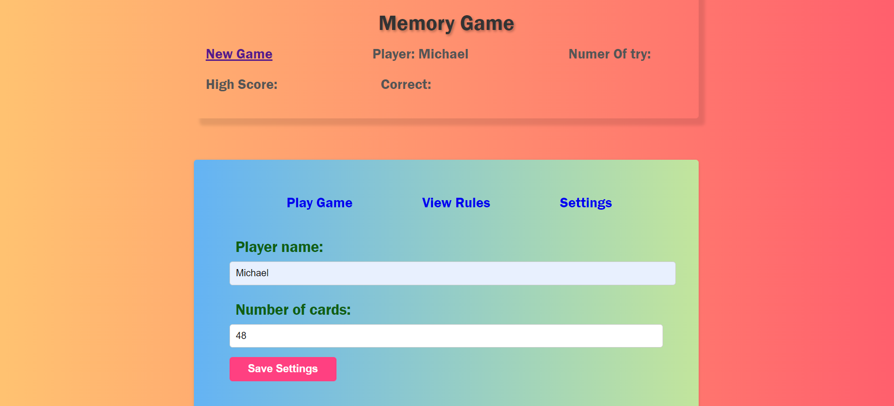

# 🧠 Memory Game

## 📌 Project Overview

**Memory Game** is an interactive web-based game where players match pairs of images by flipping cards. The goal is to complete the game in the fewest number of attempts possible while tracking the player's score.

This project was developed as a **college group project**, with multiple contributors working on different sections of the code. Since all JavaScript, HTML, and CSS code is contained within single shared files, my specific contributions are integrated within the overall development of the game.

---

## 🌍 Live Demo

🎮 **Try it out here**: [Memory Game Live Demo](https://memory-game-zeta-tawny.vercel.app)

---

## 🚀 Features

- 🎮 **Interactive Memory Game**: Players flip cards to find matching pairs.
- 🏆 **Score Tracking**: Keeps track of attempts and correct matches.
- 🛠 **Game Settings**: Allows players to customize the number of cards.
- 🔀 **Randomized Cards**: Each game session shuffles the card positions.
- 🎨 **Styled UI**: Responsive and visually appealing interface.
- ⚠️ **Turn-Based Selection**: Players must wait for the game to validate a match before selecting another pair. Rapid selection may cause unexpected behavior.

---

## 🛠 Technologies Used

- **🌐 HTML5**: Structure of the game.
- **🎨 CSS3 & jQuery UI**: Styling and interactive animations.
- **📚 JavaScript (ES6+)**: Core game logic.
- **🔄 jQuery**: Handles DOM manipulation and UI interactions.

---

## 📌 Project Purpose

This project demonstrates:

- **JavaScript Game Development**: Implementing dynamic, interactive gameplay using JavaScript.
- **DOM Manipulation**: Utilizing JavaScript and jQuery to manage game elements dynamically.
- **Game Logic & State Management**: Ensuring smooth and engaging gameplay with tracking mechanisms.
- **User Experience (UX) Optimization**: Enhancing engagement through animations, styling, and real-time feedback.
- **Responsive Design**: Adapting the UI for different screen sizes and devices.
- **Team Collaboration**: Integrating multiple contributions within a single shared codebase.

---

## 📂 Project Structure

```
📝 memory_game_project
 ├── 📝 index.html         # Main game interface
 ├── 📝 app.js            # JavaScript logic for the game
 ├── 📝 memory.css        # Styles for the game UI
 ├── 📝 jquery-ui.min.js  # jQuery UI library for interactive elements
 ├── 📝 jquery-ui.min.css # jQuery UI styles
 ├── 📝 images/             # Image assets
```

---

## 📌 Prerequisites

To run the project, ensure you have:

- A modern web browser (Chrome, Firefox, Edge, etc.).
- Internet access (to load external libraries like jQuery).

---

## 🏃‍♂️ How to Play

1️⃣ Open `index.html` in a web browser.

2️⃣ Click on two cards to flip them over.

3️⃣ If they match, they remain flipped; if not, they turn back.

4️⃣ **Wait for the validation process** before selecting a new pair.

5️⃣ Continue until all pairs are matched.

6️⃣ The game tracks your **attempts** and **high score**.

---

## 🎯 My Contribution

Since all code is integrated into shared files, my work is embedded within the overall project development, contributing to:

- **Game logic in JavaScript** (`app.js`).
- **HTML structure** (`index.html`).
- **Styling and UI elements** (`memory.css`).

---

## 🖼 Screenshots

| Home | Settings |
|-----------|-----------|
|  |  |

---

## 📝 License

This project was developed for educational purposes as part of a **college final project**.

---

## 💼 Author

👤 **Juan Jacobo Florez Monroy**  
🌐 **Portfolio**: [jjacobo95.com](https://jjacobo95.com)  
🐙 **GitHub**: [github.com/jjacoboflorez95](https://github.com/jjacoboflorez95)